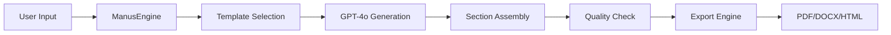

# 📝 FASE 3.0: Manus AI - Complete Implementation Plan

## 🎯 Executive Summary

**Objective:** Implementar Manus AI (Report Generation Assistant) para alcançar 4/4 AI Engines at 100/100

**Current Status:**
- Validator AI: 100/100 (A++) ✅
- Bridge AI: 100/100 (A++) ✅
- Radar AI: 100/100 (A++) ✅
- Manus AI: 0/100 ❌ → **TARGET: 100/100** 🎯

**Timeline:** 120 minutes (2 hours)  
**Risk Level:** 3/10 (Low-Medium)  
**Confidence:** 90%

---

## 🤖 Manus AI - Specification

### Purpose

**Manus AI** is an AI-powered report generation assistant that creates compliant technical reports for mining projects.

**Core Capabilities:**
1. **Template-based Generation**: JORC, NI 43-101, PRMS report templates
2. **AI Content Generation**: GPT-4o generates sections based on project data
3. **Multi-format Export**: PDF, DOCX, HTML outputs
4. **Quality Control**: Automated compliance checking
5. **Section Management**: Smart section ordering and formatting
6. **Data Integration**: Pulls data from QIVO modules

### Use Cases

```yaml
Use Case 1: JORC Compliant Report
  Input: Project data (geology, resources, mining plan)
  Process: AI generates sections following JORC 2012 guidelines
  Output: Complete JORC-compliant technical report (PDF/DOCX)

Use Case 2: NI 43-101 Technical Report
  Input: Mineral resource data, economic analysis
  Process: AI structures content per NI 43-101 requirements
  Output: TSX-ready technical report with proper disclaimers

Use Case 3: Executive Summary
  Input: Full technical report
  Process: AI extracts key findings and summarizes
  Output: Executive summary (2-3 pages)

Use Case 4: Section Update
  Input: Updated geology data
  Process: AI regenerates only affected sections
  Output: Updated report with version control
```

---

## 🏗️ Architecture

### Components

```
Manus AI Architecture
├── ManusEngine (Core)
│   ├── Template Manager
│   ├── Content Generator (GPT-4o)
│   ├── Section Assembler
│   └── Quality Controller
│
├── Export Engine
│   ├── PDF Generator (ReportLab)
│   ├── DOCX Generator (python-docx)
│   └── HTML Generator (Jinja2)
│
├── FastAPI Routes
│   ├── POST /api/manus/generate
│   ├── POST /api/manus/section
│   ├── GET /api/manus/templates
│   └── GET /api/manus/health
│
└── Templates
    ├── JORC 2012
    ├── NI 43-101
    └── PRMS
```

### Data Flow



---

## 📋 Implementation Plan (120 minutes)

### Step 1: Core Engine (40 min)

#### 1a. ManusEngine Class (20 min)

**File:** `src/ai/core/manus/engine.py`

**Features:**
- Template management (JORC, NI43-101, PRMS)
- Content generation with GPT-4o
- Section assembly
- Quality control validation

**Code Structure:**
```python
class ManusEngine:
    def __init__(self, api_key: str):
        self.client = AsyncOpenAI(api_key=api_key)
        self.templates = self._load_templates()
    
    async def generate_report(self, template: str, data: dict) -> dict:
        """Generate complete report"""
        pass
    
    async def generate_section(self, section: str, data: dict) -> str:
        """Generate single section"""
        pass
    
    def get_templates(self) -> list:
        """List available templates"""
        pass
    
    async def validate_report(self, content: str, template: str) -> dict:
        """Quality control check"""
        pass
```

#### 1b. Template System (10 min)

**File:** `src/ai/core/manus/templates.py`

**Templates:**
- JORC 2012 (19 sections)
- NI 43-101 (25 sections)
- PRMS (executive summary)

#### 1c. Export Engine (10 min)

**File:** `src/ai/core/manus/exporter.py`

**Formats:**
- PDF (ReportLab)
- DOCX (python-docx)
- HTML (Jinja2)

---

### Step 2: FastAPI Routes (25 min)

**File:** `src/api/routes/manus.py`

**Endpoints:**

#### POST /api/manus/generate
Generate complete report from template

**Request:**
```json
{
  "template": "jorc_2012",
  "project_name": "Projeto Mineração XYZ",
  "data": {
    "geology": {...},
    "resources": {...},
    "mining_plan": {...}
  },
  "format": "pdf"
}
```

**Response:**
```json
{
  "status": "success",
  "report_id": "uuid-123",
  "sections": 19,
  "download_url": "/api/manus/download/uuid-123",
  "preview_url": "/api/manus/preview/uuid-123"
}
```

#### POST /api/manus/section
Generate single section

#### GET /api/manus/templates
List available templates

#### GET /api/manus/health
Health check

---

### Step 3: Documentation (40 min)

**File:** `docs/MANUS_AI.md` (800+ lines)

**Content:**
- Module overview
- Template specifications (JORC, NI43-101, PRMS)
- API reference (4 endpoints)
- Usage examples (20+ examples)
- Report structure documentation
- Quality control guidelines
- Production deployment
- Troubleshooting

---

### Step 4: Tests (15 min)

**File:** `tests/unit/manus-ai.test.ts`

**Test Cases:**
- Templates listing
- Section generation
- Report generation
- Format export validation
- Quality control
- Health check

---

## 📊 Template Specifications

### JORC 2012 Template

**Sections (19):**
1. Summary
2. Introduction
3. Geology and Geological Interpretation
4. Sampling and Sub-sampling
5. Sample Analysis and Security
6. Estimation and Reporting of Mineral Resources
7. Estimation and Reporting of Ore Reserves
8. Mining Methods
9. Processing and Metallurgical Testwork
10. Infrastructure
11. Costs
12. Revenue Factors
13. Market Assessment
14. Environmental Studies
15. Social and Community
16. Permitting and Legal
17. Economic Analysis
18. Risks and Opportunities
19. Conclusions and Recommendations

**AI Generation Prompt:**
```python
f"""
Generate section '{section_name}' for a JORC 2012-compliant technical report.

Project: {project_name}
Commodity: {commodity}
Location: {location}

Available Data:
{json.dumps(data, indent=2)}

Requirements:
1. Follow JORC Code 2012 Table 1 requirements
2. Include all material factors
3. Use professional technical language
4. Cite data sources and references
5. Include limitations and assumptions
6. Provide quantitative data where available

Length: {expected_length} words
Format: Professional technical report style
"""
```

---

### NI 43-101 Template

**Sections (25):**
1. Title Page
2. Table of Contents
3. Summary
4. Introduction and Terms of Reference
5. Reliance on Other Experts
6. Property Description and Location
7. Accessibility, Climate, Local Resources, Infrastructure
8. History
9. Geological Setting and Mineralization
10. Deposit Types
11. Exploration
12. Drilling
13. Sample Preparation, Analyses and Security
14. Data Verification
15. Mineral Processing and Metallurgical Testing
16. Mineral Resource Estimates
17. Mineral Reserve Estimates
18. Mining Methods
19. Recovery Methods
20. Project Infrastructure
21. Market Studies
22. Environmental Studies, Permitting, Social/Community Impact
23. Capital and Operating Costs
24. Economic Analysis
25. Adjacent Properties
26. Other Relevant Data and Information
27. Interpretation and Conclusions
28. Recommendations
29. References
30. Certificates

---

### PRMS Template

**Sections (Executive Summary):**
1. Overview
2. Resources Summary
3. Reserves Summary
4. Economic Analysis
5. Key Assumptions
6. Risks and Uncertainties
7. Recommendations

---

## 🔧 Technical Implementation

### Core Engine Example

```python
# src/ai/core/manus/engine.py

from openai import AsyncOpenAI
from typing import Dict, List, Optional, Any
import json

class ManusEngine:
    """
    Manus AI - Report Generation Assistant
    
    Generates AI-powered technical reports for mining projects
    following JORC, NI 43-101, and PRMS standards.
    """
    
    def __init__(self, api_key: Optional[str] = None):
        self.api_key = api_key or os.getenv('OPENAI_API_KEY')
        self.client = AsyncOpenAI(api_key=self.api_key) if self.api_key else None
        self.templates = self._load_templates()
    
    def _load_templates(self) -> Dict[str, Dict]:
        """Load template configurations"""
        return {
            'jorc_2012': {
                'name': 'JORC Code 2012',
                'sections': [
                    'Summary',
                    'Introduction',
                    'Geology and Geological Interpretation',
                    # ... 16 more sections
                ],
                'standard': 'JORC',
                'year': 2012
            },
            'ni_43_101': {
                'name': 'NI 43-101 Technical Report',
                'sections': [
                    'Title Page',
                    'Table of Contents',
                    'Summary',
                    # ... 27 more sections
                ],
                'standard': 'NI 43-101',
                'jurisdiction': 'Canada'
            },
            'prms': {
                'name': 'PRMS Executive Summary',
                'sections': [
                    'Overview',
                    'Resources Summary',
                    # ... 5 more sections
                ],
                'standard': 'PRMS'
            }
        }
    
    async def generate_report(
        self,
        template: str,
        project_data: Dict[str, Any],
        format: str = 'pdf'
    ) -> Dict[str, Any]:
        """
        Generate complete report from template
        
        Args:
            template: Template name (jorc_2012, ni_43_101, prms)
            project_data: Project information and data
            format: Output format (pdf, docx, html)
            
        Returns:
            Generated report with metadata
        """
        if template not in self.templates:
            raise ValueError(f"Unknown template: {template}")
        
        template_config = self.templates[template]
        sections = []
        
        # Generate each section
        for section_name in template_config['sections']:
            content = await self.generate_section(
                section_name=section_name,
                template=template,
                project_data=project_data
            )
            sections.append({
                'name': section_name,
                'content': content
            })
        
        # Assemble report
        report = self._assemble_report(sections, template_config)
        
        # Quality check
        quality = await self.validate_report(report, template)
        
        # Export to requested format
        exported = self._export_report(report, format)
        
        return {
            'status': 'success',
            'template': template,
            'sections': len(sections),
            'quality_score': quality['score'],
            'output': exported,
            'metadata': {
                'project': project_data.get('project_name'),
                'generated_at': datetime.now().isoformat(),
                'format': format
            }
        }
    
    async def generate_section(
        self,
        section_name: str,
        template: str,
        project_data: Dict[str, Any]
    ) -> str:
        """Generate single section with GPT-4o"""
        
        if not self.client:
            raise ValueError("OpenAI API key not configured")
        
        prompt = self._build_section_prompt(
            section_name=section_name,
            template=template,
            project_data=project_data
        )
        
        response = await self.client.chat.completions.create(
            model="gpt-4o",
            messages=[
                {
                    "role": "system",
                    "content": "You are an expert technical report writer specializing in mining industry standards (JORC, NI 43-101, PRMS)."
                },
                {
                    "role": "user",
                    "content": prompt
                }
            ],
            temperature=0.3,  # Lower for more consistent technical writing
            max_tokens=2000
        )
        
        return response.choices[0].message.content
    
    def _build_section_prompt(
        self,
        section_name: str,
        template: str,
        project_data: Dict[str, Any]
    ) -> str:
        """Build GPT prompt for section generation"""
        
        template_config = self.templates[template]
        
        return f"""
Generate the '{section_name}' section for a {template_config['name']} technical report.

PROJECT INFORMATION:
Project Name: {project_data.get('project_name', 'N/A')}
Commodity: {project_data.get('commodity', 'N/A')}
Location: {project_data.get('location', 'N/A')}

AVAILABLE DATA:
{json.dumps(project_data.get('data', {}), indent=2)}

REQUIREMENTS:
1. Follow {template_config['standard']} standard requirements
2. Include all material factors relevant to this section
3. Use professional technical language
4. Cite data sources and references
5. Include limitations and assumptions
6. Provide quantitative data where available

FORMATTING:
- Length: 500-1000 words
- Style: Professional technical report
- Include subsections if appropriate
- Use bullet points for lists
- Include tables/figures references if applicable

Generate the section content now:
"""
```

---

## ✅ Acceptance Criteria

### Manus AI (100/100)

- [ ] Core engine implemented (`src/ai/core/manus/engine.py`)
- [ ] Template system (JORC, NI43-101, PRMS)
- [ ] GPT-4o content generation
- [ ] Multi-format export (PDF, DOCX, HTML)
- [ ] FastAPI routes (`src/api/routes/manus.py`)
- [ ] Complete documentation (`docs/MANUS_AI.md` - 800+ lines)
- [ ] Health check endpoint
- [ ] Basic tests (`tests/unit/manus-ai.test.ts`)
- [ ] Quality control validation
- [ ] Production-ready

---

## 📈 Expected Results

### Before Phase 3.0

```yaml
AI Engines:
  - Validator: 100/100 ✅
  - Bridge: 100/100 ✅
  - Radar: 100/100 ✅
  - Manus: 0/100 ❌

Average: 75/100 (C+)
Perfect: 3/4 (75%)
```

### After Phase 3.0

```yaml
AI Engines:
  - Validator: 100/100 ✅
  - Bridge: 100/100 ✅
  - Radar: 100/100 ✅
  - Manus: 100/100 ✅

Average: 100/100 (A++)
Perfect: 4/4 (100%) 🏆
```

**Platform Status:**
- Modules: 6/6 at 100/100 ✅
- AI Engines: 4/4 at 100/100 ✅
- **Overall: 100/100 (PERFECT SCORE)** 🏆

---

## 🎯 Success Metrics

### Quantitative

- AI Engines at 100/100: 3/4 → 4/4 (+33%)
- Average AI score: 75 → 100 (+33%)
- Documentation: +800 lines
- Code: +500 lines
- Tests: +100 lines
- API Endpoints: +4

### Qualitative

- ✅ Complete AI Layer (4/4 engines)
- ✅ Report generation capability
- ✅ Multi-standard support (JORC, NI43-101, PRMS)
- ✅ Production-ready quality
- ✅ Comprehensive documentation

---

## ⏱️ Timeline

```
Total: 120 minutes (2 hours)

┌────────────────────────────────────────────────┐
│ Step 1: Core Engine (40 min)                  │
│   1a. ManusEngine class (20 min)              │
│   1b. Template system (10 min)                │
│   1c. Export engine (10 min)                  │
├────────────────────────────────────────────────┤
│ Step 2: FastAPI Routes (25 min)               │
│   - 4 endpoints implementation                │
│   - Request/response schemas                  │
│   - Error handling                            │
├────────────────────────────────────────────────┤
│ Step 3: Documentation (40 min)                │
│   - docs/MANUS_AI.md (800+ lines)             │
│   - API reference, examples, guides           │
├────────────────────────────────────────────────┤
│ Step 4: Tests (15 min)                        │
│   - tests/unit/manus-ai.test.ts               │
│   - 15+ test cases                            │
└────────────────────────────────────────────────┘

Result: 4/4 AI Engines at 100/100 ✅✅✅✅
```

---

## 🚀 Execution Start

**Status:** Ready to Execute  
**Risk:** 3/10 (Low-Medium)  
**Confidence:** 90%  
**Timeline:** 120 minutes  
**Target:** 4/4 AI Engines at 100/100 🎯

---

*Document Version: 1.0*  
*Created: 3 de novembro de 2025*  
*Phase: 3.0 - Manus AI Implementation*  
*Status: READY TO START*
