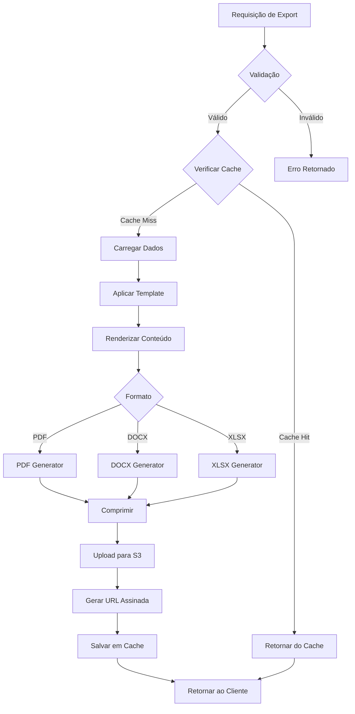

# Export API Documentation

## Visão Geral

A Export API permite exportar relatórios técnicos em múltiplos formatos (PDF, DOCX, XLSX) com conformidade a padrões internacionais (JORC, NI43-101, PERC, SAMREC, NAEN).

## Arquitetura

```
Cliente → tRPC → Export Router → Renderer Service → Cache → S3 → Cliente
```

## Endpoints

### `export.pdf`

Exporta relatório técnico em formato PDF com estrutura completa.

**Tipo:** Mutation  
**Autenticação:** Requerida

#### Input

```typescript
{
  reportId: string;                    // ID do relatório
  standard: 'JORC' | 'NI43-101' | 'PERC' | 'SAMREC' | 'NAEN';
  includeCharts?: boolean;             // Padrão: true
  includeImages?: boolean;             // Padrão: true
  watermark?: string;                  // Texto da marca d'água
  headerText?: string;                 // Cabeçalho personalizado
  footerText?: string;                 // Rodapé personalizado
}
```

#### Output

```typescript
{
  exportId: string;                    // ID único da exportação
  fileUrl: string;                     // URL temporária para download
  fileName: string;                    // Nome do arquivo gerado
  fileSize: number;                    // Tamanho em bytes
  expiresAt: Date;                     // Expiração da URL (24h)
  metadata: {
    pageCount: number;
    generatedAt: Date;
    standard: string;
  };
}
```

#### Exemplo de Uso

```typescript
import { trpc } from '@/lib/trpc';

const exportPDF = trpc.technicalReports.export.pdf.useMutation({
  onSuccess: (data) => {
    // Download automático
    const link = document.createElement('a');
    link.href = data.fileUrl;
    link.download = data.fileName;
    link.click();
  },
});

const handleExport = () => {
  exportPDF.mutate({
    reportId: 'report-123',
    standard: 'JORC',
    includeCharts: true,
    watermark: 'CONFIDENTIAL',
  });
};
```

---

### `export.docx`

Exporta relatório em formato DOCX editável com 11 seções estruturadas.

**Tipo:** Mutation  
**Autenticação:** Requerida

#### Input

```typescript
{
  reportId: string;
  standard: 'JORC' | 'NI43-101' | 'PERC' | 'SAMREC' | 'NAEN';
  sections?: Array<                    // Seções a incluir (padrão: todas)
    | 'sumario_executivo'
    | 'introducao'
    | 'geologia'
    | 'amostragem'
    | 'estimativa_recursos'
    | 'mineracao'
    | 'processamento'
    | 'infraestrutura'
    | 'analise_economica'
    | 'conclusoes'
    | 'recomendacoes'
  >;
  templateId?: string;                 // Template customizado
  includeTableOfContents?: boolean;    // Padrão: true
}
```

#### Output

```typescript
{
  exportId: string;
  fileUrl: string;
  fileName: string;
  fileSize: number;
  expiresAt: Date;
  metadata: {
    sectionCount: number;
    wordCount: number;
    tableCount: number;
    imageCount: number;
  };
}
```

#### Exemplo de Uso

```typescript
const exportDOCX = trpc.technicalReports.export.docx.useMutation();

const handleExportDOCX = async () => {
  const result = await exportDOCX.mutateAsync({
    reportId: 'report-123',
    standard: 'NI43-101',
    sections: [
      'sumario_executivo',
      'geologia',
      'estimativa_recursos',
      'analise_economica',
      'conclusoes',
    ],
    includeTableOfContents: true,
  });

  // Download
  window.location.href = result.fileUrl;
};
```

---

### `export.xlsx`

Exporta dados do relatório em planilha XLSX com 7 worksheets.

**Tipo:** Mutation  
**Autenticação:** Requerida

#### Input

```typescript
{
  reportId: string;
  standard: 'JORC' | 'NI43-101' | 'PERC' | 'SAMREC' | 'NAEN';
  worksheets?: Array<                  // Planilhas a incluir (padrão: todas)
    | 'sumario'
    | 'dados_geologicos'
    | 'amostragem'
    | 'recursos'
    | 'reservas'
    | 'custos'
    | 'cronograma'
  >;
  includeFormulas?: boolean;           // Padrão: true
  includeCharts?: boolean;             // Padrão: false
}
```

#### Output

```typescript
{
  exportId: string;
  fileUrl: string;
  fileName: string;
  fileSize: number;
  expiresAt: Date;
  metadata: {
    worksheetCount: number;
    rowCount: number;
    formulaCount: number;
    chartCount: number;
  };
}
```

#### Exemplo de Uso

```typescript
const exportXLSX = trpc.technicalReports.export.xlsx.useMutation();

const handleExportXLSX = async () => {
  const result = await exportXLSX.mutateAsync({
    reportId: 'report-123',
    standard: 'JORC',
    worksheets: ['sumario', 'recursos', 'reservas', 'custos'],
    includeFormulas: true,
    includeCharts: true,
  });

  // Download
  const a = document.createElement('a');
  a.href = result.fileUrl;
  a.download = result.fileName;
  a.click();
};
```

---

### `export.getStatus`

Consulta status de uma exportação em andamento.

**Tipo:** Query  
**Autenticação:** Requerida

#### Input

```typescript
{
  exportId: string;
}
```

#### Output

```typescript
{
  exportId: string;
  status: 'pending' | 'processing' | 'completed' | 'failed';
  progress: number;                    // 0-100
  currentStep: string;                 // Ex: "Gerando páginas..."
  fileUrl?: string;                    // Disponível quando completed
  error?: {
    message: string;
    code: string;
  };
}
```

---

### `export.cancel`

Cancela uma exportação em andamento.

**Tipo:** Mutation  
**Autenticação:** Requerida

#### Input

```typescript
{
  exportId: string;
}
```

#### Output

```typescript
{
  exportId: string;
  canceled: boolean;
  message: string;
}
```

---

### `export.history`

Lista histórico de exportações do usuário.

**Tipo:** Query  
**Autenticação:** Requerida

#### Input

```typescript
{
  limit?: number;                      // Padrão: 20
  offset?: number;                     // Padrão: 0
  reportId?: string;                   // Filtrar por relatório
  format?: 'pdf' | 'docx' | 'xlsx';   // Filtrar por formato
  orderBy?: 'createdAt' | 'fileSize';
  orderDir?: 'asc' | 'desc';
}
```

#### Output

```typescript
{
  exports: Array<{
    exportId: string;
    reportId: string;
    format: string;
    fileSize: number;
    createdAt: Date;
    expiresAt: Date;
    isExpired: boolean;
  }>;
  total: number;
  hasMore: boolean;
}
```

---

## Estrutura de Exportação

### PDF

```
📄 relatorio-tecnico-JORC-2024.pdf
├── Capa
│   ├── Título
│   ├── Logo
│   └── Data
├── Índice
├── Sumário Executivo (2-3 páginas)
├── 1. Introdução
├── 2. Geologia Regional
├── 3. Amostragem e Metodologia
├── 4. Estimativa de Recursos
├── 5. Plano de Mineração
├── 6. Processamento Mineral
├── 7. Infraestrutura
├── 8. Análise Econômica
├── 9. Conclusões
├── 10. Recomendações
├── Anexos
│   ├── Tabelas Detalhadas
│   ├── Gráficos
│   └── Mapas
└── Referências
```

### DOCX (11 Seções)

1. **Sumário Executivo**: Síntese de 2-3 páginas
2. **Introdução**: Contexto e objetivos
3. **Geologia**: Descrição geológica regional e local
4. **Amostragem**: Metodologia e controle de qualidade
5. **Estimativa de Recursos**: Classificação JORC/NI43-101
6. **Mineração**: Plano de lavra e cronograma
7. **Processamento**: Fluxograma e recuperação
8. **Infraestrutura**: Instalações e logística
9. **Análise Econômica**: VPL, TIR, payback
10. **Conclusões**: Resultados principais
11. **Recomendações**: Próximos passos

### XLSX (7 Worksheets)

1. **Sumário**: Indicadores principais
2. **Dados Geológicos**: Litologia, alteração
3. **Amostragem**: Resultados de análises
4. **Recursos**: Classificação por categoria
5. **Reservas**: Recursos convertidos
6. **Custos**: CAPEX, OPEX, breakdown
7. **Cronograma**: Fases do projeto

---

## Otimizações e Cache

### Performance

- **Memoização**: Resultados cacheados por 5 minutos
- **Deduplicação**: Requisições simultâneas compartilham resultado
- **Lazy Loading**: Imagens carregadas sob demanda
- **Compressão**: Arquivos comprimidos automaticamente

### Métricas

```typescript
const stats = await trpc.technicalReports.export.getStats.query();

console.log({
  pdfAverageTime: stats.pdf.avgTime,      // ~2.5s
  docxAverageTime: stats.docx.avgTime,    // ~1.8s
  xlsxAverageTime: stats.xlsx.avgTime,    // ~1.2s
  cacheHitRate: stats.cacheHitRate,       // ~75%
});
```

---

## Validações e Limites

### Limites

- **Taxa de exportação**: 10 exportações/minuto por usuário
- **Tamanho máximo do PDF**: 50 MB
- **Tamanho máximo do DOCX**: 30 MB
- **Tamanho máximo do XLSX**: 20 MB
- **Expiration das URLs**: 24 horas

### Erros Comuns

| Código | Descrição | Solução |
|--------|-----------|---------|
| `REPORT_NOT_FOUND` | Relatório não existe | Verificar reportId |
| `EXPORT_TOO_LARGE` | Arquivo excede limite | Reduzir seções/worksheets |
| `RATE_LIMIT_EXCEEDED` | Taxa excedida | Aguardar 1 minuto |
| `RENDERING_FAILED` | Erro ao gerar arquivo | Verificar dados do relatório |
| `INVALID_STANDARD` | Padrão inválido | Usar JORC, NI43-101, etc. |
| `TEMPLATE_NOT_FOUND` | Template não existe | Verificar templateId |

---

## Fluxo de Exportação



---

## Exemplos Completos

### Export com Progress Tracking

```typescript
function ExportWithProgress({ reportId }: { reportId: string }) {
  const [exportId, setExportId] = useState<string>();
  const [progress, setProgress] = useState(0);

  const exportMutation = trpc.technicalReports.export.pdf.useMutation({
    onSuccess: (data) => setExportId(data.exportId),
  });

  const { data: status } = trpc.technicalReports.export.getStatus.useQuery(
    { exportId: exportId! },
    {
      enabled: !!exportId && progress < 100,
      refetchInterval: 500,
      onSuccess: (data) => {
        setProgress(data.progress);
        if (data.status === 'completed' && data.fileUrl) {
          // Auto download
          window.location.href = data.fileUrl;
        }
      },
    }
  );

  const handleExport = () => {
    exportMutation.mutate({
      reportId,
      standard: 'JORC',
      includeCharts: true,
    });
  };

  return (
    <div>
      <button onClick={handleExport} disabled={exportMutation.isLoading}>
        Exportar PDF
      </button>
      {status && (
        <div>
          <progress value={progress} max={100} />
          <p>{status.currentStep}</p>
        </div>
      )}
    </div>
  );
}
```

### Export com Cancelamento

```typescript
function ExportWithCancel({ reportId }: { reportId: string }) {
  const [exportId, setExportId] = useState<string>();

  const exportMutation = trpc.technicalReports.export.docx.useMutation({
    onSuccess: (data) => setExportId(data.exportId),
  });

  const cancelMutation = trpc.technicalReports.export.cancel.useMutation({
    onSuccess: () => {
      setExportId(undefined);
      toast.success('Exportação cancelada');
    },
  });

  const handleExport = () => {
    exportMutation.mutate({
      reportId,
      standard: 'NI43-101',
      sections: ['sumario_executivo', 'geologia', 'recursos'],
    });
  };

  const handleCancel = () => {
    if (exportId) {
      cancelMutation.mutate({ exportId });
    }
  };

  return (
    <div>
      <button onClick={handleExport}>Exportar</button>
      {exportId && (
        <button onClick={handleCancel}>Cancelar</button>
      )}
    </div>
  );
}
```

### Export Multi-Formato

```typescript
function ExportMultiFormat({ reportId }: { reportId: string }) {
  const exportPDF = trpc.technicalReports.export.pdf.useMutation();
  const exportDOCX = trpc.technicalReports.export.docx.useMutation();
  const exportXLSX = trpc.technicalReports.export.xlsx.useMutation();

  const handleExportAll = async () => {
    const standard = 'JORC';

    const [pdf, docx, xlsx] = await Promise.all([
      exportPDF.mutateAsync({ reportId, standard }),
      exportDOCX.mutateAsync({ reportId, standard }),
      exportXLSX.mutateAsync({ reportId, standard }),
    ]);

    // Download sequencial
    setTimeout(() => window.location.href = pdf.fileUrl, 0);
    setTimeout(() => window.location.href = docx.fileUrl, 1000);
    setTimeout(() => window.location.href = xlsx.fileUrl, 2000);
  };

  return (
    <div>
      <button onClick={handleExportAll}>
        Exportar Todos os Formatos
      </button>
    </div>
  );
}
```

---

## Padrões Internacionais

### JORC (2012)

- **País**: Austrália
- **Classificação**: Measured, Indicated, Inferred
- **Seções obrigatórias**: 4 (Sampling, Estimation, Reporting, Competent Person)
- **Tabela**: Table 1 (Checklist)

### NI 43-101 (Canadá)

- **País**: Canadá
- **Classificação**: Measured, Indicated, Inferred
- **Seções obrigatórias**: 27 itens
- **Certificação**: Qualified Person (QP)

### PERC (2021)

- **Região**: Europa
- **Classificação**: Aligned with JORC/NI43-101
- **Foco**: Pan-European standards

### SAMREC (2016)

- **País**: África do Sul
- **Classificação**: Similar to JORC
- **Code**: South African Code

### NAEN (2017)

- **Região**: Rússia/Eurásia
- **Classificação**: A, B, C1, C2
- **Foco**: FSU countries

---

## Webhooks

Configure webhooks para notificações de eventos:

```typescript
// Eventos disponíveis
'export.started'
'export.completed'
'export.failed'
'export.canceled'
```

Ver [Webhooks API](./WEBHOOKS_API.md) para mais detalhes.

---

## Melhores Práticas

1. **Sempre especificar o padrão** (JORC, NI43-101, etc.)
2. **Usar progress tracking** para exports grandes
3. **Implementar fallback** para download manual
4. **Cache de resultados** para exports frequentes
5. **Cleanup de URLs** expiradas
6. **Validar dados** antes de exportar
7. **Feedback visual** durante processamento

---

## Recursos Adicionais

- [Upload API](./UPLOAD_API.md)
- [Templates API](./TEMPLATES_API.md)
- [DOCX Renderer](../../server/modules/technical-reports/services/docx-renderer.ts)
- [XLSX Renderer](../../server/modules/technical-reports/services/xlsx-renderer.ts)
