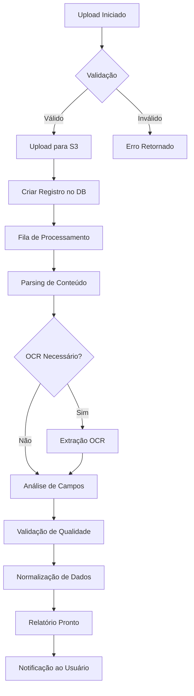

# Upload API Documentation

## Visão Geral

A Upload API fornece endpoints para upload de relatórios técnicos em diversos formatos (PDF, DOCX, XLSX, CSV, ZIP) com processamento assíncrono e análise automática.

## Arquitetura

```
Cliente → tRPC → Upload Router → Processamento Assíncrono → Análise → Notificação
```

## Endpoints

### `upload.single`

Upload de um único arquivo com processamento completo.

**Tipo:** Mutation  
**Autenticação:** Requerida

#### Input

```typescript
{
  fileName: string;      // Nome do arquivo (ex: "report.pdf")
  fileSize: number;      // Tamanho em bytes
  fileType: string;      // MIME type (ex: "application/pdf")
  fileData: string;      // Arquivo codificado em base64
}
```

#### Output

```typescript
{
  uploadId: string;      // ID único do upload
  reportId: string;      // ID do relatório criado
  status: 'processing' | 'completed' | 'failed';
  s3Url?: string;        // URL do arquivo no S3 (se aplicável)
  message: string;       // Mensagem de status
}
```

#### Exemplo de Uso

```typescript
import { trpc } from '@/lib/trpc';

const uploadMutation = trpc.technicalReports.uploads.single.useMutation({
  onSuccess: (data) => {
    console.log('Upload successful:', data.reportId);
  },
  onError: (error) => {
    console.error('Upload failed:', error.message);
  },
});

// Converter arquivo para base64
const fileToBase64 = (file: File): Promise<string> => {
  return new Promise((resolve, reject) => {
    const reader = new FileReader();
    reader.onload = () => {
      const base64 = (reader.result as string).split(',')[1];
      resolve(base64);
    };
    reader.onerror = reject;
    reader.readAsDataURL(file);
  });
};

// Upload
const handleUpload = async (file: File) => {
  const fileData = await fileToBase64(file);
  
  await uploadMutation.mutateAsync({
    fileName: file.name,
    fileSize: file.size,
    fileType: file.type || 'application/pdf',
    fileData,
  });
};
```

---

### `upload.batch`

Upload de múltiplos arquivos em lote (até 10 arquivos).

**Tipo:** Mutation  
**Autenticação:** Requerida

#### Input

```typescript
{
  files: Array<{
    fileName: string;
    fileSize: number;
    fileType: string;
    fileData: string;  // base64
  }>;
}
```

#### Output

```typescript
{
  batchId: string;
  uploads: Array<{
    uploadId: string;
    reportId: string;
    fileName: string;
    status: 'processing' | 'completed' | 'failed';
    error?: string;
  }>;
  totalFiles: number;
  successCount: number;
  failureCount: number;
}
```

#### Exemplo de Uso

```typescript
const batchMutation = trpc.technicalReports.uploads.batch.useMutation();

const handleBatchUpload = async (files: File[]) => {
  // Converter todos para base64
  const filesData = await Promise.all(
    files.map(async (file) => ({
      fileName: file.name,
      fileSize: file.size,
      fileType: file.type || 'application/pdf',
      fileData: await fileToBase64(file),
    }))
  );

  const result = await batchMutation.mutateAsync({ files: filesData });
  
  console.log(`Batch upload: ${result.successCount}/${result.totalFiles} succeeded`);
};
```

---

### `upload.getStatus`

Consulta o status de um upload.

**Tipo:** Query  
**Autenticação:** Requerida

#### Input

```typescript
{
  uploadId: string;
}
```

#### Output

```typescript
{
  uploadId: string;
  reportId?: string;
  fileName: string;
  status: 'pending' | 'uploading' | 'processing' | 'completed' | 'failed';
  progress: number;      // 0-100
  currentStep: string;   // Descrição da etapa atual
  error?: {
    message: string;
    code: string;
  };
  createdAt: Date;
  updatedAt: Date;
}
```

#### Exemplo de Uso

```typescript
const { data: uploadStatus } = trpc.technicalReports.uploads.getStatus.useQuery(
  { uploadId: 'upload-123' },
  {
    refetchInterval: 2000, // Poll a cada 2 segundos
    enabled: !!uploadId,
  }
);

if (uploadStatus?.status === 'completed') {
  console.log('Processing complete!');
}
```

---

### `upload.retry`

Reprocessa um upload que falhou.

**Tipo:** Mutation  
**Autenticação:** Requerida

#### Input

```typescript
{
  uploadId: string;
  maxAttempts?: number;  // Padrão: 3
}
```

#### Output

```typescript
{
  uploadId: string;
  status: string;
  attemptNumber: number;
  message: string;
}
```

---

### `upload.list`

Lista uploads do usuário atual.

**Tipo:** Query  
**Autenticação:** Requerida

#### Input

```typescript
{
  limit?: number;        // Padrão: 20
  offset?: number;       // Padrão: 0
  status?: 'pending' | 'completed' | 'failed';
  orderBy?: 'createdAt' | 'fileName';
  orderDir?: 'asc' | 'desc';
}
```

#### Output

```typescript
{
  uploads: Array<{
    uploadId: string;
    reportId?: string;
    fileName: string;
    fileSize: number;
    status: string;
    createdAt: Date;
  }>;
  total: number;
  hasMore: boolean;
}
```

---

## Validações

### Formatos Aceitos

- **PDF**: `application/pdf`
- **DOCX**: `application/vnd.openxmlformats-officedocument.wordprocessingml.document`
- **XLSX**: `application/vnd.openxmlformats-officedocument.spreadsheetml.sheet`
- **CSV**: `text/csv`
- **ZIP**: `application/zip`

### Limites

- **Tamanho máximo por arquivo**: 50 MB
- **Batch máximo**: 10 arquivos
- **Taxa de upload**: 20 uploads/minuto por usuário
- **Retry máximo**: 3 tentativas

### Erros Comuns

| Código | Descrição | Solução |
|--------|-----------|---------|
| `FILE_TOO_LARGE` | Arquivo excede 50MB | Comprimir ou dividir arquivo |
| `INVALID_FORMAT` | Formato não suportado | Converter para formato aceito |
| `BATCH_LIMIT_EXCEEDED` | Mais de 10 arquivos | Dividir em múltiplos batches |
| `RATE_LIMIT_EXCEEDED` | Taxa excedida | Aguardar 1 minuto |
| `PARSING_FAILED` | Erro ao analisar conteúdo | Verificar integridade do arquivo |
| `OCR_FAILED` | Falha no OCR | Verificar qualidade da imagem |

---

## Fluxo de Processamento



---

## Monitoramento

### Métricas Disponíveis

```typescript
const metrics = await trpc.technicalReports.uploads.getMetrics.query({
  period: '24h' | '7d' | '30d',
});

console.log({
  totalUploads: metrics.total,
  successRate: metrics.successRate,
  avgProcessingTime: metrics.avgProcessingTime,
  topErrors: metrics.topErrors,
});
```

---

## Webhooks

Configure webhooks para receber notificações de eventos:

```typescript
// Eventos disponíveis
'upload.started'
'upload.completed'
'upload.failed'
'upload.retry'
'processing.started'
'processing.completed'
```

Ver [Webhooks API](./WEBHOOKS_API.md) para mais detalhes.

---

## Exemplos Completos

### Upload com Progress Tracking

```typescript
function UploadWithProgress({ file }: { file: File }) {
  const [uploadId, setUploadId] = useState<string>();
  const [progress, setProgress] = useState(0);

  const uploadMutation = trpc.technicalReports.uploads.single.useMutation({
    onSuccess: (data) => setUploadId(data.uploadId),
  });

  const { data: status } = trpc.technicalReports.uploads.getStatus.useQuery(
    { uploadId: uploadId! },
    {
      enabled: !!uploadId,
      refetchInterval: 1000,
      onSuccess: (data) => setProgress(data.progress),
    }
  );

  const handleUpload = async () => {
    const fileData = await fileToBase64(file);
    await uploadMutation.mutateAsync({
      fileName: file.name,
      fileSize: file.size,
      fileType: file.type,
      fileData,
    });
  };

  return (
    <div>
      <button onClick={handleUpload}>Upload</button>
      {status && (
        <div>
          <progress value={progress} max={100} />
          <p>{status.currentStep}</p>
        </div>
      )}
    </div>
  );
}
```

### Batch Upload com Retry

```typescript
function BatchUploadWithRetry({ files }: { files: File[] }) {
  const [results, setResults] = useState<any[]>([]);
  
  const batchMutation = trpc.technicalReports.uploads.batch.useMutation({
    onSuccess: (data) => setResults(data.uploads),
  });

  const retryMutation = trpc.technicalReports.uploads.retry.useMutation();

  const handleBatchUpload = async () => {
    const filesData = await Promise.all(
      files.map(async (file) => ({
        fileName: file.name,
        fileSize: file.size,
        fileType: file.type,
        fileData: await fileToBase64(file),
      }))
    );

    await batchMutation.mutateAsync({ files: filesData });
  };

  const handleRetry = async (uploadId: string) => {
    await retryMutation.mutateAsync({ uploadId });
  };

  return (
    <div>
      <button onClick={handleBatchUpload}>Upload All</button>
      {results.map((result) => (
        <div key={result.uploadId}>
          <span>{result.fileName}: {result.status}</span>
          {result.status === 'failed' && (
            <button onClick={() => handleRetry(result.uploadId)}>
              Retry
            </button>
          )}
        </div>
      ))}
    </div>
  );
}
```

---

## Melhores Práticas

1. **Sempre validar arquivos no cliente** antes de enviar
2. **Usar progress tracking** para uploads grandes
3. **Implementar retry automático** para falhas temporárias
4. **Chunked uploads** para arquivos > 10MB (planejado)
5. **Cleanup de URLs blob** após uso
6. **Rate limiting** no cliente para evitar sobrecarga
7. **Feedback visual** claro para o usuário

---

## Recursos Adicionais

- [Export API](./EXPORT_API.md)
- [Templates API](./TEMPLATES_API.md)
- [OCR Service](./OCR_SERVICE.md)
- [Webhooks API](./WEBHOOKS_API.md)
