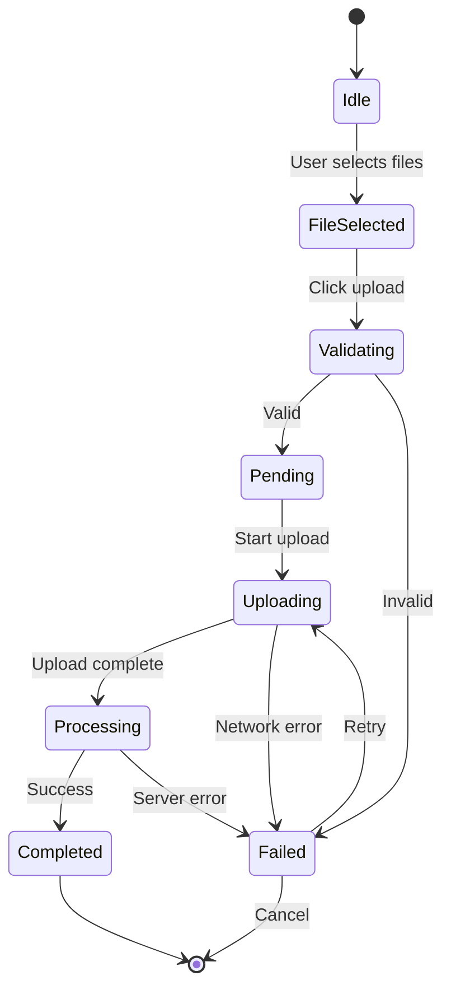

# BatchUploadModal Component Documentation

## Visão Geral

O `BatchUploadModal` é um componente React avançado para upload simultâneo de múltiplos arquivos PDF (até 10) com progress tracking individual, validação completa, retry automático e preview integrado.

## Estrutura de Arquivos

```
client/src/modules/technical-reports/components/
└── BatchUploadModal.tsx          # Componente principal (~400 linhas)
```

## Importação

```typescript
import { BatchUploadModal } from '@/modules/technical-reports/components/BatchUploadModal';
```

## Props

### `BatchUploadModalProps`

```typescript
interface BatchUploadModalProps {
  // Controle de visibilidade (obrigatório)
  open: boolean;
  onOpenChange: (open: boolean) => void;
  
  // Callback quando upload completa (opcional)
  onUploadComplete?: (results: UploadResult[]) => void;
  
  // Limite de arquivos (opcional, padrão: 10)
  maxFiles?: number;
  
  // Tamanho máximo por arquivo em bytes (opcional, padrão: 50MB)
  maxFileSize?: number;
  
  // Tipos de arquivo aceitos (opcional, padrão: ['application/pdf'])
  acceptedTypes?: string[];
  
  // Mostrar preview de PDFs (opcional, padrão: true)
  showPreview?: boolean;
  
  // Permitir retry de arquivos falhados (opcional, padrão: true)
  enableRetry?: boolean;
  
  // Auto-fechar após upload completo (opcional, padrão: false)
  autoClose?: boolean;
  
  // Tempo de auto-close em ms (opcional, padrão: 3000)
  autoCloseDelay?: number;
}

interface UploadResult {
  uploadId: string;
  reportId?: string;
  fileName: string;
  status: 'success' | 'failed';
  error?: string;
  fileSize: number;
}
```

## Uso Básico

### Modal Simples

```typescript
import { useState } from 'react';
import { BatchUploadModal } from '@/modules/technical-reports/components/BatchUploadModal';

function UploadButton() {
  const [open, setOpen] = useState(false);

  return (
    <>
      <button onClick={() => setOpen(true)}>
        Upload Reports
      </button>

      <BatchUploadModal
        open={open}
        onOpenChange={setOpen}
        onUploadComplete={(results) => {
          console.log(`Uploaded ${results.length} files`);
        }}
      />
    </>
  );
}
```

### Com Configurações Customizadas

```typescript
function CustomBatchUpload() {
  const [open, setOpen] = useState(false);

  return (
    <BatchUploadModal
      open={open}
      onOpenChange={setOpen}
      maxFiles={5}                      // Máximo 5 arquivos
      maxFileSize={30 * 1024 * 1024}   // 30 MB
      showPreview={true}
      enableRetry={true}
      autoClose={true}
      autoCloseDelay={5000}
      onUploadComplete={(results) => {
        const successCount = results.filter(r => r.status === 'success').length;
        toast.success(`${successCount} files uploaded successfully`);
      }}
    />
  );
}
```

## Funcionalidades

### 1. Seleção de Arquivos

```typescript
// Drag & Drop
- Arraste arquivos para a área de drop
- Destaque visual quando arrastar sobre a área
- Suporte a múltiplos arquivos simultâneos

// Click to Browse
- Clique no botão "Select Files"
- Dialog de seleção de arquivos nativa
- Seleção múltipla habilitada
```

### 2. Validação

```typescript
// Validações aplicadas automaticamente
const validations = {
  fileType: {
    accepted: ['application/pdf'],
    error: 'Only PDF files are accepted',
  },
  
  fileSize: {
    max: 50 * 1024 * 1024,  // 50 MB
    error: 'File exceeds 50MB limit',
  },
  
  fileName: {
    pattern: /^[a-zA-Z0-9_\-\.]+$/,
    error: 'Invalid characters in filename',
  },
  
  batchSize: {
    max: 10,
    error: 'Maximum 10 files per batch',
  },
  
  duplicates: {
    check: true,
    error: 'File already added',
  },
};
```

### 3. Progress Tracking

```typescript
// Individual por arquivo
{
  fileName: 'report-1.pdf',
  status: 'uploading',
  progress: 67,          // 0-100
  bytesUploaded: 33_554_432,
  totalBytes: 50_000_000,
  speed: '2.5 MB/s',
  eta: '8s',
}

// Geral do batch
{
  totalFiles: 5,
  completedFiles: 3,
  failedFiles: 1,
  uploadingFiles: 1,
  overallProgress: 60,   // (3 + 0.67) / 5 * 100
}
```

### 4. Retry Mechanism

```typescript
// Retry automático em 3 situações
const retryScenarios = [
  'Network error',
  'Timeout (> 60s)',
  'Server error (500-599)',
];

// Configuração de retry
const retryConfig = {
  maxAttempts: 3,
  backoff: 'exponential',  // 1s, 2s, 4s
  onlyFailed: true,        // Retry apenas falhados
};
```

### 5. Preview Integration

```typescript
// Preview de PDF individual
- Clique no ícone de preview
- Modal fullscreen com LazyPDFViewer
- Navegação entre páginas
- Zoom e controles completos
- Fechar preview sem cancelar upload
```

### 6. Estado dos Arquivos

```typescript
type FileStatus = 
  | 'pending'      // Aguardando upload
  | 'validating'   // Validando arquivo
  | 'uploading'    // Upload em progresso
  | 'processing'   // Processamento server-side
  | 'completed'    // Sucesso
  | 'failed';      // Erro

// Ícones visuais para cada estado
const statusIcons = {
  pending: <ClockIcon />,
  validating: <SpinnerIcon />,
  uploading: <UploadIcon />,
  processing: <CogIcon />,
  completed: <CheckCircleIcon />,
  failed: <XCircleIcon />,
};
```

## Interface Visual

### Layout

```
┌─────────────────────────────────────────────────────┐
│  Batch Upload - Technical Reports                  │
├─────────────────────────────────────────────────────┤
│  ┌───────────────────────────────────────────────┐ │
│  │  Drag & Drop Files Here                       │ │
│  │  or                                            │ │
│  │  [Select Files]                                │ │
│  │                                                 │ │
│  │  Up to 10 PDF files, max 50MB each            │ │
│  └───────────────────────────────────────────────┘ │
│                                                     │
│  Files (3/10)                                       │
│  ┌───────────────────────────────────────────────┐ │
│  │ 📄 report-1.pdf                   [Preview][X]│ │
│  │ ▓▓▓▓▓▓▓▓▓░░░░░░░ 67% - 2.5 MB/s - 8s        │ │
│  ├───────────────────────────────────────────────┤ │
│  │ 📄 report-2.pdf                   [Preview][X]│ │
│  │ ✓ Completed - 15.2 MB                        │ │
│  ├───────────────────────────────────────────────┤ │
│  │ 📄 report-3.pdf                   [Retry] [X]│ │
│  │ ✗ Failed: Network error                      │ │
│  └───────────────────────────────────────────────┘ │
│                                                     │
│  Overall Progress: 2.67 / 3 files (89%)            │
│  ▓▓▓▓▓▓▓▓▓▓▓▓▓▓▓▓▓▓░░ 89%                         │
│                                                     │
│  [Cancel All]        [Upload All] [Close]          │
└─────────────────────────────────────────────────────┘
```

## Exemplos Avançados

### Com Formulário de Metadados

```typescript
function BatchUploadWithMetadata() {
  const [open, setOpen] = useState(false);
  const [files, setFiles] = useState<File[]>([]);
  const [metadata, setMetadata] = useState<Record<string, any>>({});

  return (
    <Dialog open={open} onOpenChange={setOpen}>
      <DialogContent className="max-w-4xl">
        <div className="grid grid-cols-2 gap-4">
          {/* Upload */}
          <div>
            <h3>Upload Files</h3>
            <BatchUploadModal
              open={open}
              onOpenChange={setOpen}
              onUploadComplete={(results) => {
                // Associar metadados
                results.forEach((result) => {
                  const meta = metadata[result.fileName];
                  if (meta) {
                    // Salvar metadados
                    saveMetadata(result.reportId, meta);
                  }
                });
              }}
            />
          </div>

          {/* Metadados */}
          <div>
            <h3>Metadata</h3>
            {files.map((file) => (
              <div key={file.name}>
                <p>{file.name}</p>
                <input
                  type="text"
                  placeholder="Project Name"
                  onChange={(e) =>
                    setMetadata({
                      ...metadata,
                      [file.name]: {
                        ...metadata[file.name],
                        projectName: e.target.value,
                      },
                    })
                  }
                />
                <select
                  onChange={(e) =>
                    setMetadata({
                      ...metadata,
                      [file.name]: {
                        ...metadata[file.name],
                        standard: e.target.value,
                      },
                    })
                  }
                >
                  <option value="JORC">JORC</option>
                  <option value="NI43-101">NI 43-101</option>
                </select>
              </div>
            ))}
          </div>
        </div>
      </DialogContent>
    </Dialog>
  );
}
```

### Com Webhook para Notificação

```typescript
function BatchUploadWithNotifications() {
  const [open, setOpen] = useState(false);

  // Subscribe to webhook events
  useEffect(() => {
    const unsubscribe = subscribeToWebhook('batch.completed', (data) => {
      toast.success(`Batch ${data.batchId} completed!`);
      
      // Mostrar resumo
      const { successCount, failureCount } = data;
      console.log(`Success: ${successCount}, Failed: ${failureCount}`);
    });

    return () => unsubscribe();
  }, []);

  return (
    <BatchUploadModal
      open={open}
      onOpenChange={setOpen}
      onUploadComplete={(results) => {
        // Webhooks já enviados automaticamente
        console.log('Results:', results);
      }}
    />
  );
}
```

### Com Análise de Duplicatas

```typescript
function BatchUploadWithDuplicateCheck() {
  const [open, setOpen] = useState(false);
  const checkDuplicates = trpc.technicalReports.checkDuplicates.useMutation();

  const handleBeforeUpload = async (files: File[]) => {
    // Calcular hash dos arquivos
    const hashes = await Promise.all(
      files.map(async (file) => ({
        name: file.name,
        hash: await calculateFileHash(file),
      }))
    );

    // Verificar duplicatas no servidor
    const result = await checkDuplicates.mutateAsync({ hashes });

    if (result.duplicates.length > 0) {
      const confirm = window.confirm(
        `Found ${result.duplicates.length} duplicate(s). Upload anyway?`
      );
      return confirm;
    }

    return true;
  };

  return (
    <BatchUploadModal
      open={open}
      onOpenChange={setOpen}
      onBeforeUpload={handleBeforeUpload}
    />
  );
}
```

### Com Análise Pós-Upload

```typescript
function BatchUploadWithAnalysis() {
  const [open, setOpen] = useState(false);
  const [analysisResults, setAnalysisResults] = useState<any[]>([]);

  return (
    <>
      <BatchUploadModal
        open={open}
        onOpenChange={setOpen}
        onUploadComplete={async (results) => {
          // Analisar cada relatório
          const analyses = await Promise.all(
            results
              .filter((r) => r.status === 'success')
              .map(async (result) => {
                const analysis = await analyzeReport(result.reportId);
                return {
                  fileName: result.fileName,
                  ...analysis,
                };
              })
          );

          setAnalysisResults(analyses);
          setOpen(false);
        }}
      />

      {/* Mostrar resultados */}
      {analysisResults.length > 0 && (
        <div>
          <h3>Analysis Results</h3>
          {analysisResults.map((result) => (
            <div key={result.fileName}>
              <p>{result.fileName}</p>
              <ul>
                <li>Standard: {result.detectedStandard}</li>
                <li>Confidence: {result.confidence}%</li>
                <li>Sections: {result.sectionCount}</li>
              </ul>
            </div>
          ))}
        </div>
      )}
    </>
  );
}
```

## Estados e Transições



## Eventos

### Callbacks Disponíveis

```typescript
interface BatchUploadCallbacks {
  // Antes de começar upload
  onBeforeUpload?: (files: File[]) => Promise<boolean>;
  
  // Quando arquivo individual completa
  onFileComplete?: (result: UploadResult) => void;
  
  // Quando arquivo individual falha
  onFileError?: (fileName: string, error: Error) => void;
  
  // Quando todo batch completa
  onUploadComplete?: (results: UploadResult[]) => void;
  
  // Quando progresso muda
  onProgressChange?: (progress: BatchProgress) => void;
  
  // Quando arquivo é removido
  onFileRemove?: (fileName: string) => void;
  
  // Quando modal fecha
  onClose?: () => void;
}
```

## Validações e Erros

### Mensagens de Erro

```typescript
const errorMessages = {
  FILE_TOO_LARGE: 'File exceeds maximum size of 50MB',
  INVALID_TYPE: 'Only PDF files are accepted',
  DUPLICATE_FILE: 'File already added to batch',
  BATCH_LIMIT: 'Maximum 10 files per batch',
  INVALID_NAME: 'Filename contains invalid characters',
  NETWORK_ERROR: 'Network error, please retry',
  SERVER_ERROR: 'Server error, please try again later',
  TIMEOUT: 'Upload timed out after 60 seconds',
  UNKNOWN: 'An unknown error occurred',
};
```

### Tratamento de Erros

```typescript
// Erro em arquivo individual
- Marca arquivo como 'failed'
- Mostra mensagem de erro
- Habilita botão de retry
- Continua upload dos outros arquivos

// Erro no batch inteiro
- Para todos os uploads
- Mostra alerta geral
- Oferece retry para todos
- Mantém arquivos válidos na lista
```

## Performance

### Otimizações

```typescript
const optimizations = {
  // Upload simultâneo limitado
  concurrentUploads: 3,  // Máximo 3 uploads simultâneos
  
  // Chunked upload para arquivos grandes
  chunkSize: 5 * 1024 * 1024,  // 5 MB chunks
  enableChunking: true,         // Para arquivos > 10MB
  
  // Compressão
  compression: {
    enabled: false,  // PDFs já são comprimidos
  },
  
  // Retry exponencial
  retryBackoff: {
    initial: 1000,    // 1s
    multiplier: 2,    // 2x a cada tentativa
    max: 10000,       // Máximo 10s
  },
  
  // Memoization
  memoizeValidation: true,  // Cache de validações
};
```

### Métricas

```typescript
// Tempos médios
{
  validation: '< 100ms por arquivo',
  uploadSpeed: '2-5 MB/s',
  singleFile: '5-15 segundos (10MB)',
  batchOf10: '1-2 minutos (100MB total)',
}
```

## Accessibility

### Keyboard Navigation

```
Tab: Navegar entre controles
Enter/Space: Ativar botão
Escape: Fechar modal
Delete: Remover arquivo selecionado
```

### ARIA Labels

```typescript
<div
  role="region"
  aria-label="Batch file upload"
  aria-describedby="upload-instructions"
>
  <p id="upload-instructions">
    Upload up to 10 PDF files, maximum 50MB each
  </p>
  
  <button
    aria-label="Select files to upload"
    onClick={handleSelectFiles}
  >
    Select Files
  </button>
  
  <ul role="list" aria-label="Files to upload">
    {files.map((file) => (
      <li
        key={file.name}
        role="listitem"
        aria-label={`${file.name}, ${file.status}`}
      >
        {/* File item */}
      </li>
    ))}
  </ul>
</div>
```

## Testing

### Unit Tests

```typescript
import { render, screen, fireEvent } from '@testing-library/react';
import { BatchUploadModal } from './BatchUploadModal';

test('accepts valid PDF files', async () => {
  const handleComplete = jest.fn();
  
  render(
    <BatchUploadModal
      open={true}
      onOpenChange={() => {}}
      onUploadComplete={handleComplete}
    />
  );

  const file = new File(['content'], 'test.pdf', { type: 'application/pdf' });
  const input = screen.getByLabelText('Select files');
  
  fireEvent.change(input, { target: { files: [file] } });
  
  expect(screen.getByText('test.pdf')).toBeInTheDocument();
});

test('rejects files over size limit', () => {
  render(<BatchUploadModal open={true} onOpenChange={() => {}} />);

  const largeFile = new File(
    [new ArrayBuffer(51 * 1024 * 1024)],
    'large.pdf',
    { type: 'application/pdf' }
  );

  const input = screen.getByLabelText('Select files');
  fireEvent.change(input, { target: { files: [largeFile] } });

  expect(screen.getByText(/exceeds 50MB/)).toBeInTheDocument();
});
```

### E2E Tests

Ver [upload-batch.spec.ts](../../tests/e2e/upload-batch.spec.ts) para testes E2E completos.

## Melhores Práticas

1. **Sempre validar arquivos** antes de enviar
2. **Limitar uploads simultâneos** a 3-5
3. **Implementar retry automático** para falhas temporárias
4. **Mostrar progress detalhado** por arquivo
5. **Cleanup de URLs blob** após uso
6. **Feedback visual claro** para cada estado
7. **Permitir cancelamento** individual e global

## Recursos Adicionais

- [Upload API](../api/UPLOAD_API.md)
- [PDFViewer Component](./PDFVIEWER.md)
- [OCR Service](./OCR_SERVICE.md)
- [E2E Tests](../../tests/e2e/upload-batch.spec.ts)
