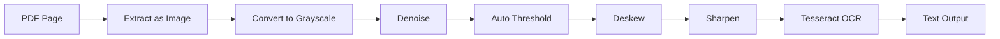

# OCR Service API Documentation

## Visão Geral

O OCR Service fornece extração inteligente de texto de documentos PDF através de reconhecimento óptico de caracteres (OCR) com suporte a múltiplos idiomas, análise de qualidade e detecção automática de padrões regulatórios.

## Arquitetura

```
PDF Upload → Image Extraction → Pre-processing → Tesseract OCR → 
  → Text Analysis → Standard Detection → Confidence Scoring → Result
```

## Tecnologias

- **OCR Engine**: Tesseract 5.x
- **Image Processing**: Sharp, Canvas
- **Language Detection**: franc
- **PDF Parsing**: pdf-parse, pdf2pic
- **Idiomas suportados**: Português (pt), Inglês (en), Espanhol (es)

## API Endpoints

### `ocr.extract`

Extrai texto de um documento PDF com OCR completo.

**Tipo:** Mutation  
**Autenticação:** Requerida

#### Input

```typescript
{
  uploadId: string;                    // ID do upload
  language?: 'pt' | 'en' | 'es' | 'auto'; // Padrão: 'auto'
  pageRange?: {
    start: number;                     // Página inicial (1-indexed)
    end: number;                       // Página final
  };
  options?: {
    enhanceImage?: boolean;            // Pré-processamento (padrão: true)
    detectTables?: boolean;            // Detectar tabelas (padrão: true)
    detectStandards?: boolean;         // Detectar padrões (padrão: true)
    minConfidence?: number;            // Confiança mínima (padrão: 70)
  };
}
```

#### Output

```typescript
{
  extractionId: string;
  uploadId: string;
  status: 'processing' | 'completed' | 'failed';
  progress: number;                    // 0-100
  result?: {
    text: string;                      // Texto extraído completo
    pages: Array<{
      pageNumber: number;
      text: string;
      confidence: number;              // 0-100
      language: string;
      wordCount: number;
      processingTime: number;          // Em ms
    }>;
    metadata: {
      totalPages: number;
      totalWords: number;
      averageConfidence: number;
      detectedLanguages: string[];
      detectedStandards: Array<{
        standard: 'JORC' | 'NI43-101' | 'PERC' | 'SAMREC' | 'NAEN';
        confidence: number;
        keywords: string[];
      }>;
      processingTime: number;          // Total em ms
    };
    tables?: Array<{
      pageNumber: number;
      rows: number;
      cols: number;
      data: string[][];
    }>;
  };
  error?: {
    message: string;
    code: string;
  };
}
```

#### Exemplo de Uso

```typescript
import { trpc } from '@/lib/trpc';

const ocrMutation = trpc.technicalReports.ocr.extract.useMutation({
  onSuccess: (data) => {
    console.log('Text extracted:', data.result?.text);
    console.log('Confidence:', data.result?.metadata.averageConfidence);
  },
});

const handleExtract = () => {
  ocrMutation.mutate({
    uploadId: 'upload-123',
    language: 'pt',
    pageRange: { start: 1, end: 10 },
    options: {
      enhanceImage: true,
      detectTables: true,
      detectStandards: true,
      minConfidence: 80,
    },
  });
};
```

---

### `ocr.getStatus`

Consulta o status de uma extração OCR em andamento.

**Tipo:** Query  
**Autenticação:** Requerida

#### Input

```typescript
{
  extractionId: string;
}
```

#### Output

```typescript
{
  extractionId: string;
  status: 'pending' | 'processing' | 'completed' | 'failed';
  progress: number;                    // 0-100
  currentPage: number;
  totalPages: number;
  estimatedTimeRemaining: number;      // Em segundos
  currentStep: string;                 // Ex: "Processing page 5 of 20"
}
```

---

### `ocr.correct`

Corrige manualmente texto extraído via OCR.

**Tipo:** Mutation  
**Autenticação:** Requerida

#### Input

```typescript
{
  extractionId: string;
  pageNumber: number;
  corrections: Array<{
    original: string;                  // Texto original OCR
    corrected: string;                 // Texto corrigido
    position?: {                       // Posição opcional
      start: number;
      end: number;
    };
  }>;
}
```

#### Output

```typescript
{
  extractionId: string;
  pageNumber: number;
  correctionsApplied: number;
  updatedText: string;
  updatedConfidence: number;
}
```

---

### `ocr.reprocess`

Reprocessa uma página com parâmetros diferentes.

**Tipo:** Mutation  
**Autenticação:** Requerida

#### Input

```typescript
{
  extractionId: string;
  pageNumber: number;
  language?: string;
  enhanceImage?: boolean;
  ocrMode?: 'accurate' | 'fast';      // Padrão: 'accurate'
}
```

#### Output

```typescript
{
  extractionId: string;
  pageNumber: number;
  text: string;
  confidence: number;
  processingTime: number;
}
```

---

### `ocr.getPageImage`

Obtém imagem pré-processada de uma página.

**Tipo:** Query  
**Autenticação:** Requerida

#### Input

```typescript
{
  extractionId: string;
  pageNumber: number;
  enhanced?: boolean;                  // Padrão: true
}
```

#### Output

```typescript
{
  imageUrl: string;                    // URL temporária
  width: number;
  height: number;
  expiresAt: Date;
}
```

---

## Pré-processamento de Imagens

### Técnicas Aplicadas

```typescript
const imageEnhancements = {
  // 1. Conversão para escala de cinza
  grayscale: true,
  
  // 2. Binarização (Otsu's method)
  threshold: 'auto',
  
  // 3. Remoção de ruído
  denoise: {
    enabled: true,
    level: 'medium',  // 'low' | 'medium' | 'high'
  },
  
  // 4. Ajuste de contraste
  contrast: {
    enabled: true,
    factor: 1.2,      // 1.0 = sem mudança
  },
  
  // 5. Nitidez
  sharpen: {
    enabled: true,
    sigma: 1.0,
  },
  
  // 6. Deskew (correção de inclinação)
  deskew: {
    enabled: true,
    maxAngle: 10,     // Graus
  },
  
  // 7. Redimensionamento para DPI ideal
  resize: {
    targetDPI: 300,   // Ideal para OCR
  },
};
```

### Exemplo de Pipeline



---

## Detecção de Padrões

### Padrões Regulatórios

O OCR Service detecta automaticamente menções a padrões internacionais:

```typescript
const standardPatterns = {
  JORC: {
    keywords: [
      'JORC Code',
      'Joint Ore Reserves Committee',
      'Measured Resource',
      'Indicated Resource',
      'Inferred Resource',
      'Competent Person',
      'Table 1',
    ],
    minKeywords: 3,
    weight: 1.0,
  },
  
  'NI43-101': {
    keywords: [
      'NI 43-101',
      'National Instrument',
      'Qualified Person',
      'QP',
      'Technical Report',
      'Preliminary Economic Assessment',
      'PEA',
    ],
    minKeywords: 3,
    weight: 1.0,
  },
  
  PERC: {
    keywords: [
      'PERC',
      'Pan-European',
      'PERC Code',
      'European Reserves',
    ],
    minKeywords: 2,
    weight: 0.8,
  },
  
  SAMREC: {
    keywords: [
      'SAMREC',
      'South African',
      'Mineral Resources',
      'Competent Person',
    ],
    minKeywords: 2,
    weight: 0.8,
  },
  
  NAEN: {
    keywords: [
      'NAEN',
      'Russian Code',
      'Category A',
      'Category B',
      'Category C1',
    ],
    minKeywords: 2,
    weight: 0.8,
  },
};
```

### Resultado da Detecção

```typescript
{
  detectedStandards: [
    {
      standard: 'JORC',
      confidence: 95,
      keywords: ['JORC Code', 'Measured Resource', 'Competent Person'],
      occurrences: 12,
    },
    {
      standard: 'NI43-101',
      confidence: 45,
      keywords: ['Technical Report'],
      occurrences: 2,
    },
  ],
}
```

---

## Detecção de Idiomas

### Idiomas Suportados

```typescript
const supportedLanguages = {
  pt: {
    name: 'Português',
    tesseractCode: 'por',
    confidence: 0.95,
  },
  en: {
    name: 'English',
    tesseractCode: 'eng',
    confidence: 0.95,
  },
  es: {
    name: 'Español',
    tesseractCode: 'spa',
    confidence: 0.90,
  },
};
```

### Auto-detecção

```typescript
// Detectar idioma automaticamente
const detectLanguage = (text: string) => {
  const detected = franc(text, { minLength: 50 });
  
  const languageMap = {
    por: 'pt',
    eng: 'en',
    spa: 'es',
  };
  
  return languageMap[detected] || 'en';
};
```

---

## Análise de Qualidade

### Métricas de Confiança

```typescript
interface QualityMetrics {
  // Confiança média (0-100)
  averageConfidence: number;
  
  // Palavras com baixa confiança
  lowConfidenceWords: Array<{
    word: string;
    confidence: number;
    position: { start: number; end: number };
  }>;
  
  // Caracteres problemáticos
  problematicChars: Array<{
    char: string;
    confidence: number;
    suggestions: string[];
  }>;
  
  // Qualidade da imagem
  imageQuality: {
    dpi: number;
    contrast: number;     // 0-1
    sharpness: number;    // 0-1
    skew: number;         // Graus
    noise: number;        // 0-1
  };
  
  // Recomendações
  recommendations: string[];
}
```

### Exemplo de Análise

```typescript
const qualityReport = {
  averageConfidence: 87.5,
  
  lowConfidenceWords: [
    { word: 'mineração', confidence: 65, position: { start: 150, end: 159 } },
    { word: '43-101', confidence: 58, position: { start: 320, end: 326 } },
  ],
  
  problematicChars: [
    { char: 'ã', confidence: 60, suggestions: ['a', 'ą'] },
  ],
  
  imageQuality: {
    dpi: 200,            // Baixo! Ideal: 300+
    contrast: 0.65,
    sharpness: 0.80,
    skew: 2.5,           // Leve inclinação
    noise: 0.15,
  },
  
  recommendations: [
    'Aumentar DPI para 300+ para melhor qualidade',
    'Corrigir inclinação de 2.5° antes do OCR',
    'Revisar palavras com confiança < 70%',
  ],
};
```

---

## Detecção de Tabelas

### Estrutura de Tabelas

```typescript
interface TableDetection {
  pageNumber: number;
  tables: Array<{
    id: string;
    rows: number;
    cols: number;
    bbox: {                           // Bounding box
      x: number;
      y: number;
      width: number;
      height: number;
    };
    confidence: number;
    data: Array<Array<{
      text: string;
      confidence: number;
      type: 'header' | 'data' | 'footer';
    }>>;
    headers?: string[];
  }>;
}
```

### Exemplo de Tabela Extraída

```typescript
{
  pageNumber: 5,
  tables: [
    {
      id: 'table-5-1',
      rows: 12,
      cols: 5,
      confidence: 92,
      headers: ['Resource', 'Tonnes (Mt)', 'Grade (g/t)', 'Gold (oz)', 'Category'],
      data: [
        [
          { text: 'Zone A', confidence: 95, type: 'data' },
          { text: '1.5', confidence: 98, type: 'data' },
          { text: '2.3', confidence: 97, type: 'data' },
          { text: '110,000', confidence: 93, type: 'data' },
          { text: 'Measured', confidence: 96, type: 'data' },
        ],
        // ... mais linhas
      ],
    },
  ],
}
```

---

## Exemplos Completos

### OCR com Progress Tracking

```typescript
import { useState } from 'react';
import { trpc } from '@/lib/trpc';

function OCRWithProgress({ uploadId }: { uploadId: string }) {
  const [extractionId, setExtractionId] = useState<string>();
  const [progress, setProgress] = useState(0);

  const extractMutation = trpc.technicalReports.ocr.extract.useMutation({
    onSuccess: (data) => setExtractionId(data.extractionId),
  });

  const { data: status } = trpc.technicalReports.ocr.getStatus.useQuery(
    { extractionId: extractionId! },
    {
      enabled: !!extractionId && progress < 100,
      refetchInterval: 1000,
      onSuccess: (data) => {
        setProgress(data.progress);
      },
    }
  );

  const handleExtract = () => {
    extractMutation.mutate({
      uploadId,
      language: 'auto',
      options: {
        enhanceImage: true,
        detectTables: true,
        detectStandards: true,
      },
    });
  };

  return (
    <div>
      <button onClick={handleExtract} disabled={extractMutation.isLoading}>
        Extract Text
      </button>
      
      {status && (
        <div>
          <progress value={progress} max={100} />
          <p>{status.currentStep}</p>
          <p>Page {status.currentPage} of {status.totalPages}</p>
          {status.estimatedTimeRemaining > 0 && (
            <p>~{status.estimatedTimeRemaining}s remaining</p>
          )}
        </div>
      )}
    </div>
  );
}
```

### Manual Text Correction

```typescript
function TextCorrection({ extractionId, pageNumber }: Props) {
  const [corrections, setCorrections] = useState<any[]>([]);

  const correctMutation = trpc.technicalReports.ocr.correct.useMutation();

  const { data: extraction } = trpc.technicalReports.ocr.extract.useQuery({
    extractionId,
  });

  const page = extraction?.result?.pages.find(
    (p) => p.pageNumber === pageNumber
  );

  const handleCorrect = async () => {
    await correctMutation.mutateAsync({
      extractionId,
      pageNumber,
      corrections,
    });
  };

  return (
    <div>
      <div className="text-preview">
        {page?.text}
      </div>

      <div className="corrections">
        <h3>Low Confidence Words</h3>
        {page?.lowConfidenceWords?.map((word, i) => (
          <div key={i}>
            <span>"{word.word}" (confidence: {word.confidence}%)</span>
            <input
              type="text"
              defaultValue={word.word}
              onChange={(e) => {
                const newCorrections = [...corrections];
                newCorrections[i] = {
                  original: word.word,
                  corrected: e.target.value,
                  position: word.position,
                };
                setCorrections(newCorrections);
              }}
            />
          </div>
        ))}
      </div>

      <button onClick={handleCorrect}>Apply Corrections</button>
    </div>
  );
}
```

### Side-by-Side OCR Review

```typescript
function OCRReview({ extractionId, pageNumber }: Props) {
  const { data: pageImage } = trpc.technicalReports.ocr.getPageImage.useQuery({
    extractionId,
    pageNumber,
    enhanced: true,
  });

  const { data: extraction } = trpc.technicalReports.ocr.extract.useQuery({
    extractionId,
  });

  const page = extraction?.result?.pages.find(
    (p) => p.pageNumber === pageNumber
  );

  return (
    <div className="grid grid-cols-2 gap-4">
      {/* Imagem */}
      <div>
        <h3>Page Image</h3>
        {pageImage && (
          
        )}
      </div>

      {/* Texto extraído */}
      <div>
        <h3>Extracted Text (Confidence: {page?.confidence}%)</h3>
        <div className="whitespace-pre-wrap">{page?.text}</div>
        
        {page?.confidence && page.confidence < 80 && (
          <button onClick={() => reprocessPage(extractionId, pageNumber)}>
            Reprocess with Different Settings
          </button>
        )}
      </div>
    </div>
  );
}
```

---

## Performance e Limites

### Limites

- **Tamanho máximo do PDF**: 50 MB
- **Páginas máximas por request**: 100
- **Tempo máximo de processamento**: 5 minutos
- **Taxa de processamento**: 5 OCR jobs simultâneos por usuário
- **Idiomas por request**: 1 (ou auto-detect)

### Performance

```typescript
// Tempos médios de processamento
{
  singlePage: '2-3 segundos',
  tenPages: '15-20 segundos',
  fiftyPages: '1.5-2 minutos',
  hundredPages: '3-4 minutos',
}

// Fatores que afetam performance
- Qualidade da imagem (DPI)
- Quantidade de texto por página
- Complexidade do layout
- Presença de tabelas
- Idioma do documento
```

---

## Melhores Práticas

1. **Usar auto-detect de idioma** quando não souber
2. **Habilitar enhanceImage** para PDFs de baixa qualidade
3. **Processar em batches** para documentos grandes
4. **Revisar páginas com confiança < 80%**
5. **Aplicar correções manuais** em palavras críticas
6. **Detectar padrões** para categorização automática
7. **Cachear resultados** para não reprocessar

---

## Recursos Adicionais

- [Tesseract OCR Documentation](https://github.com/tesseract-ocr/tesseract)
- [Upload API](../api/UPLOAD_API.md)
- [Export API](../api/EXPORT_API.md)
- [BatchUpload Component](./BATCH_UPLOAD.md)
